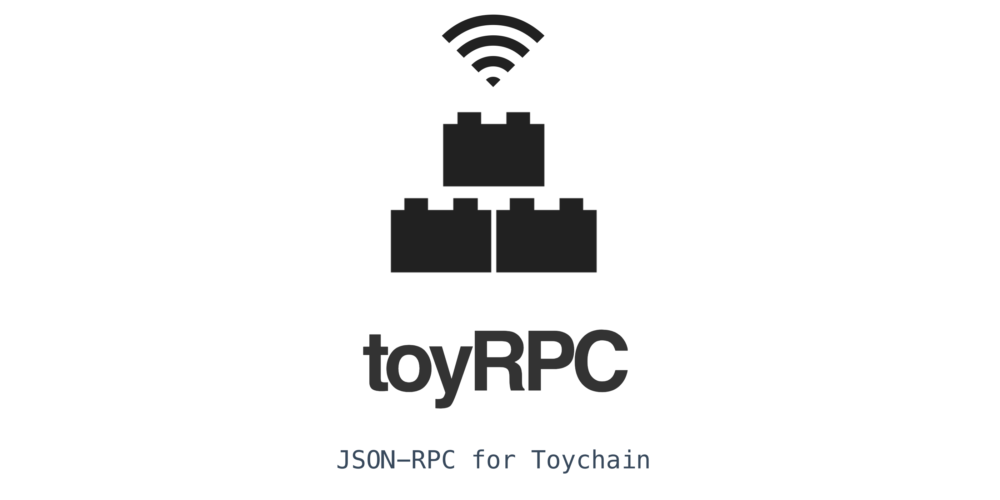

# toyrpc

> Toychain JSON-RPC

Toyrpc lets you interact with all Toychain APIs via HTTP or TCP, using the JSON-RPC 2.0 spec (https://www.jsonrpc.org/specification).



---

# Why

1. **Programming Language Agnostic:** No need to use JavaScript to program Toychain, you can simply set up a Toyrpc daemon and interact with it over JSON-RPC to clone, add, push, read, etc. --- everything you can do with Toychain.
2. **Container-friendly:** Toyrpc and its Toychain can be containerized

---

# Intall

You need to install both toychain AND toyrpc, because Toyrpc endpoints are instantiated from an existing Toychain object.

```
npm install --save toychain
npm install --save toyrpc
```

# Setting up the server

Build or find a toychain, and then instantiate a Toyrpc from the toychain.

```
const Toychain = require('toychain')
const Toyrpc = require('toyrpc')

// Build a toychain
const toychain = new Toychain({ xpriv: <xpriv> })

// Instantiate RPC for the toychain
const rpc = Toyrpc.init({
  chain: toychain,
  readonly: true,
  port: 3000,
  protocol: "http"
})
```

Here's the full syntax for `init`:

```
Toyrpc.init({
  chain: <toychain object>,
  readonly: <true|false (default false)>,
  port: <the port to serve rpc from>,
  protocol: <"http"|"tcp">
})
```

- `chain`: you need to inject an existing toychain object to build an RPC endpoint
- `readonly`: if set to `true`, you can make this RPC endpoint only readonly. All "write" actions (`clone`, `add`, `push`, and `reset`) are blocked. When readonly mode, the only allowed functions are `count` and `get`.
- `port`: The port to serve RPC from
- `protocol`: Choose to serve over HTTP or TCP. The default is HTTP.

---

# API Usage

Once the endpoint is up and running, you can make JSON-RPC 2.0 compliant requests over HTTP or TCP.

Here's an example:

```
POST http://localhost:3012

{
  "jsonrpc": "2.0",
  "method": "add",
  "params": [{
    "v": 1,
    "out": [{
      "o0": "OP_0", "o1": "OP_RETURN", "s2": "hello toy"
    }],
    "edge": { "in": 1, "out": 2 }
  }],
  "id": 0
}
```

The curreently available RPC endpoints are:

- `clone`: (write method) calls the clone method https://toychain.network/#/?id=_2-clone
- `add`: (write method) calls the add method https://toychain.network/#/?id=_3-add
- `push`: (write method) calls the push method https://toychain.network/#/?id=_4-push
- `reset`: (write method) calls the reset method https://toychain.network/#/?id=_6-reset
- `get`: (read method) calls the get method https://toychain.network/#/?id=_7-get
- `count`: (read method) calls the count method https://toychain.network/#/?id=_5-count

See JSON-RPC 2.0 Spec for more details on the JSON-RPC syntax: https://www.jsonrpc.org/specification

---

# Demo

You can try the demo under [demo/http](demo/http).

1. The [server.js](demo/http/server.js) starts a JSON-RPC server.
2. The [client.js](demo/http/client.js) lets you call various available JSON-RPC methods via HTTP

---
